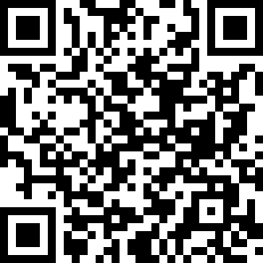
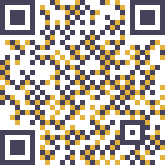
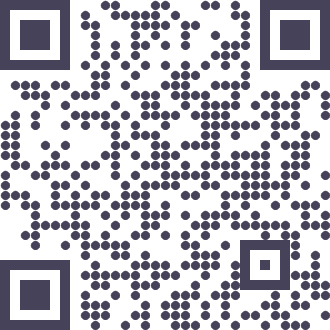
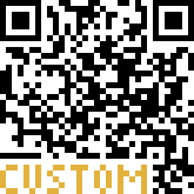

## custom\_qr Library


The **custom\_qr** library enables the generation and customization of QR codes with various options.






### Installation

1. **Install the library**:

``` sh
pip install custom_qr
```

2. **Verify Installation**:

``` sh
pip list
```

**Note**: It is recommended to use a virtual environment.

### Usage

1. **Import the library**:

``` python
from custom_qr import QrCode
from custom_qr import (
    ERROR_CORRECTION_LEVEL_H,
    ERROR_CORRECTION_LEVEL_Q,
    ERROR_CORRECTION_LEVEL_M,
    ERROR_CORRECTION_LEVEL_L
)
```

**Note**: Error correction level constants are optional.
2. **Create a QR Code**:

``` python
qr = QrCode()
matrix, version = qr.generate("https://www.qrcode.com/")
```

To specify a version and/or error correction level:

``` python
qr = QrCode()
matrix, version = qr.generate("https://www.qrcode.com/", version=6, error_correction=ERROR_CORRECTION_LEVEL_Q)
```

* **Default Error Correction Level**: `Q` (recovers 25% of data).
    * **Default Version**: Automatically calculated based on data size.

3. **Print on Console**:

``` python
qr.print_qr_console(matrix)
```

**Note**: Console output is not scannable.
4. **Get Image Version**:

``` python
img = qr.create_qr_image(matrix)
```

5. **Display On Screen**:

``` python
qr.display_qr(img)
```

6. **Save Image**:

``` python
qr.create_image_file(img, filename="qr.png")
```

**Note**: Default filename is "qr.png".

### Custom QR Code Features

**Color Usage in QR Codes**

* **Adding Text**: Be cautious, as text may cover modules and hinder scannability.
* **Contrast**: Ensure sufficient contrast between blocks, background, and fixed patterns.
* **Complexity**: Avoid overly complex color schemes to maintain scanner compatibility.

**Test QR codes with various devices to ensure scannability.**

### Customization Options

1. **Background Color**: Default is white.

``` python
background = (255, 255, 255)
qr.create_qr_image(matrix, background)
```

2. **Block/Modules Style Options**: Default size is 10, type square, and color black.
**Example**:

``` python
block_style = {
    "size": 10,
    "type": 0,
    "color": [(0, 0, 0), (255, 0, 0)]  # Black and Red
}
qr.create_qr_image(matrix, block_style)
```

* **size**: Size of each module in pixels.
    * **type**: Shape of modules:
        * **0**: Square blocks.
        * **1**: Circular blocks.
    * **color**: List of RGB tuples for module colors.

3. **Custom Circular Modules**:

``` python
block_style = {
    "size": 10,
    "type": 1,  # Circular
    "color": [(0, 0, 0), (255, 0, 0)]  # Black and Red
}
qr.create_qr_image(matrix, block_style)
```

### Finder and Alignment Pattern Colors

* **Finder Pattern**: Default color is the same of modules first color.

``` python
finder_style = {"color": (0, 0, 0)}
qr.create_qr_image(matrix, finder_style)
```

* **Alignment Pattern**: Defaults to the finder pattern's color if not specified.

``` python
alignment_style = {"color": (0, 0, 0)}
qr.create_qr_image(matrix, alignment_style)
```

### Adding Custom Text

Overlay custom text on the QR code, but be mindful of potential readability issues:

* **Text Style Options**:
    * **color**: RGB tuple for text color.
    * **size**: Font size (currently only "small" is enabled).
    * **bot**: Bottom margin in blocks.
    * **left**: Left margin in blocks.
    * **orientation**:
        * **0**: Write text from left.
        * **1**: Write text from right.

**Example**:

``` python
text_style = {
    "color": (6, 123, 194),
    "size": "small",
    "bot": 10,
    "left": 3,
    "orientation": 0
}
text = "CUSTOM"
img = qr.create_qr_image(matrix)
qr.write_text(img, text, text_style, background, block_style["size"])
```

**Write from Right**:

``` python
text_style = {
    "color": (6, 123, 194),
    "size": "small",
    "bot": 10,
    "left": 30, # Left margin has to be greater than text width
    "orientation": 1  # Adjusted to write from right
}
text = "CUSTOM"
img = qr.create_qr_image(matrix)
qr.write_text(img, text, text_style, background, block_style["size"])
```

**Note**: Use higher versions and error correction levels to maintain validity when adding text. If the text is too large, `write_text()` will return `None`.
